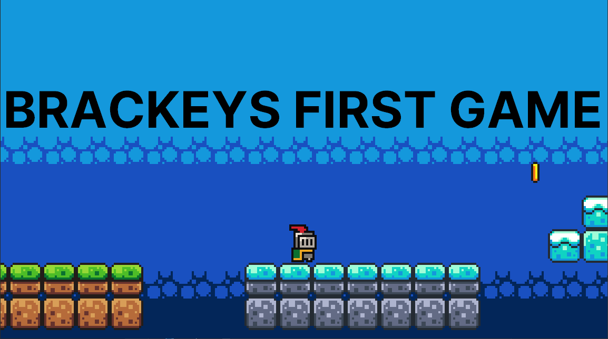

Welcome to **Brackeys First Game**, a beginner-friendly project built with the Godot Engine.
I built this game by watching the [brackeys tutorial](https://youtu.be/LOhfqjmasi0) to learn making games.

### Features

- **Collect Coins**: Players can collect coins scattered throughout the game world.
- **Ending Scoreboard**: Shows how many coins you collected at the end of the level
- **Player Movement**: Smooth player controls for navigating the game world.

### Running the game

Head over to [releases](https://github.com/Pixel-Annihilators/brackeys-first-game/releases/latest) to download an .exe file and run it. For Linux, download the .x86_64 file, give it the permission to be run as an executable, and then run it.

### CREDITS
1. [Brackeyes](https://www.youtube.com/@Brackeys)
2. See [./assets/LICENSE & CREDITS.txt](./assets/LICENSE%20&%20CREDITS.txt)
